# Serwis społecznościowy - klient

SerwisSpołecznościowyKlient to projekt serwisu społecznościowego zrobiony za pomocą frameworka Angular. Prezentuje on interfejs graficzny pozwalający użytkownikom 
na korzystanie z systemu. Jest on połączony z API napisanym za pomocą Javy i frameworka Spring boot. Aplikacja jest dostępna pod adresem https://myface.azurewebsites.net/ ale z powodu kosztów utrzymania na platformie Azure jest ona wyłączona (może zostac uruchomiona w celach prezentacyjnych).

## 

Użytkownik po wejściu na adres musi się zalogować

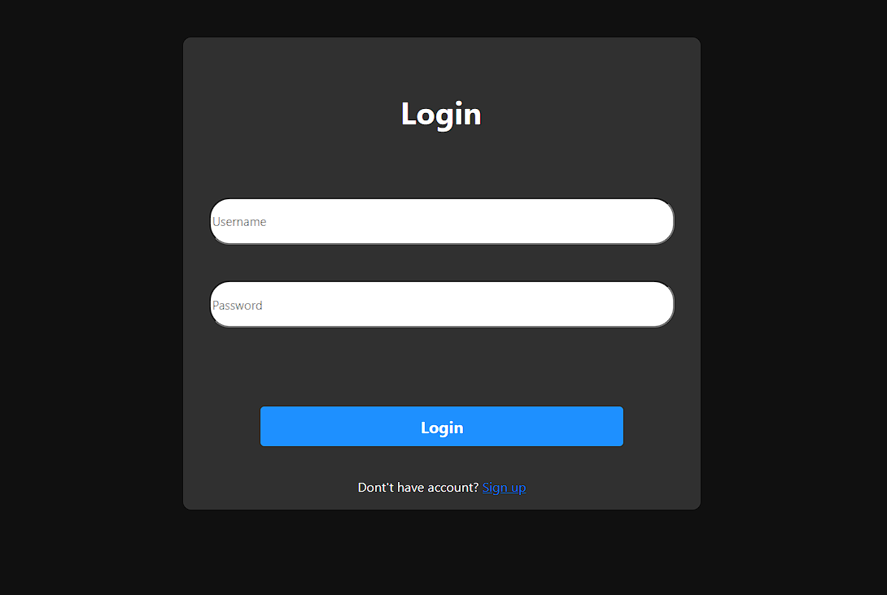

Jeśli nie posiada konta musi się zarejestrować

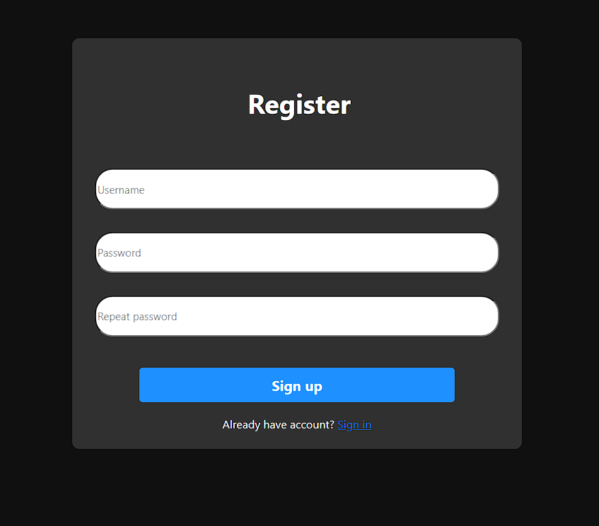

Po pomyślnym zalogowaniu przenosi się na stronę główną gdzie może dodawać swoje posty. Po prawej stronie widoczne są zakładki do których może przejść po kliknięciu w nie
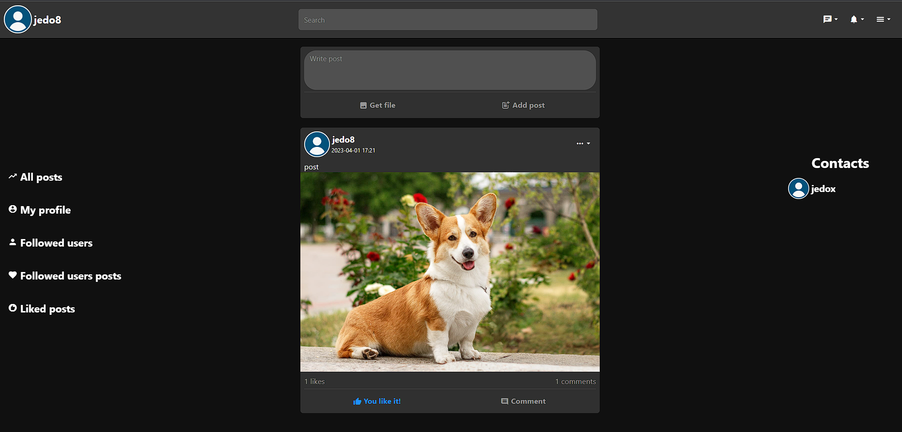

Po rozwinięciu przycisku menu może zmienić swoje zdjęcie profilowe/hasło, wyświetlić listę zablokowanych użytkowników, a także się wylogować
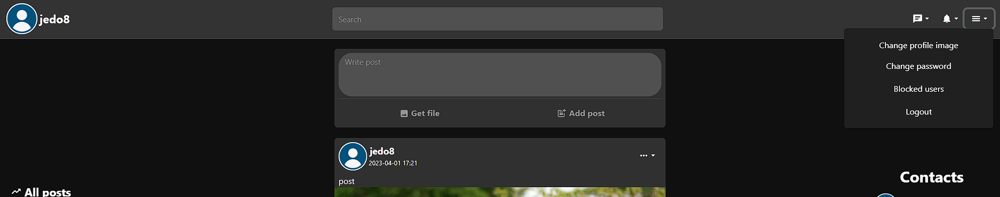

Może wyświetlić komentarze pod postem i odpowiedzi na nie, a także może napisać swój komentarz/odpowiedź
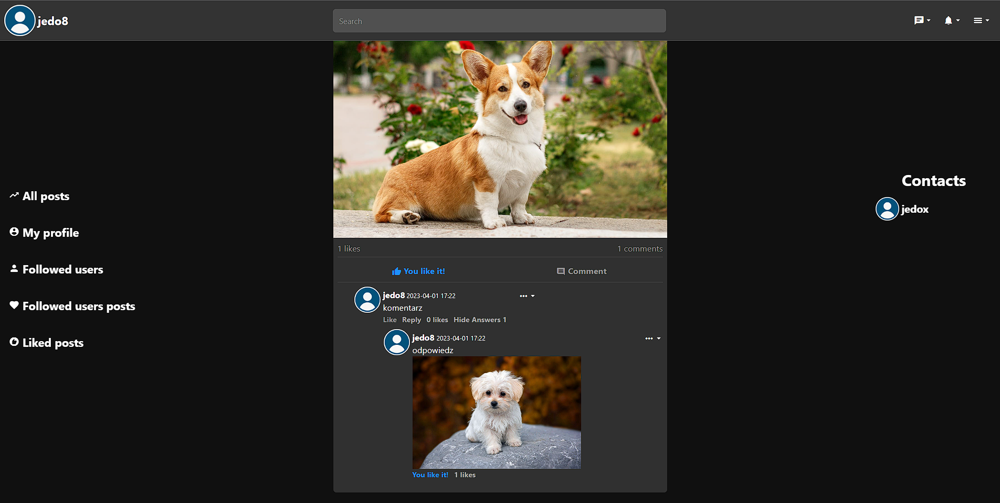
Może wyświetlić listę osób które polubiły post/komentarz/odpowiedź
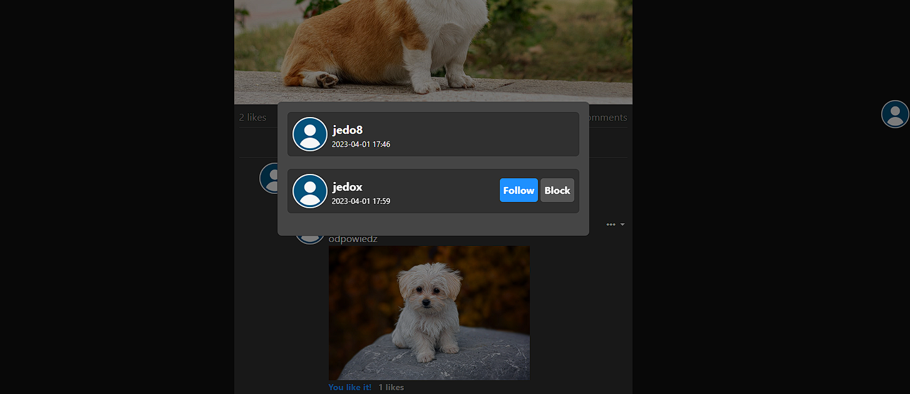
Jeśli jest autorem posta to może go edytować lub usunąć
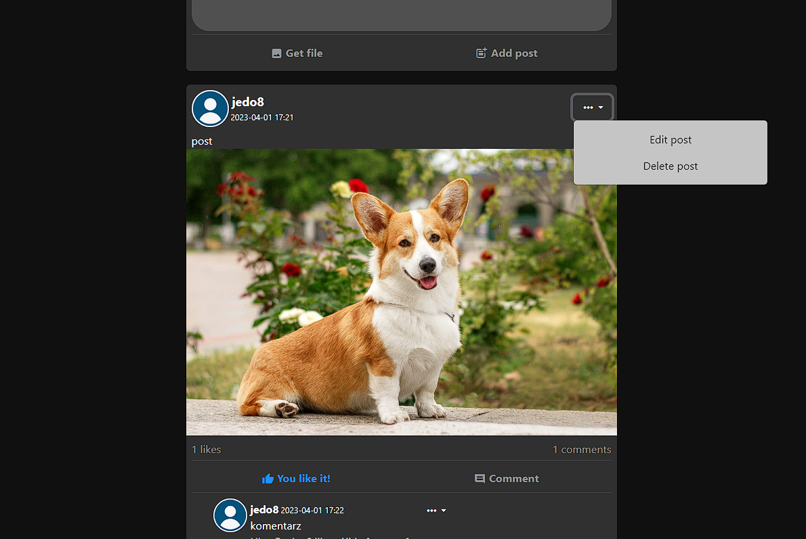

Okno edycji posta
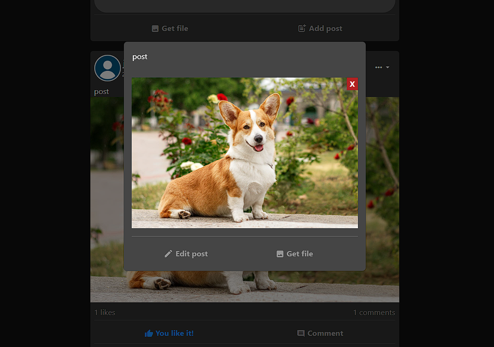

Może wyszukać użytkowników/posty
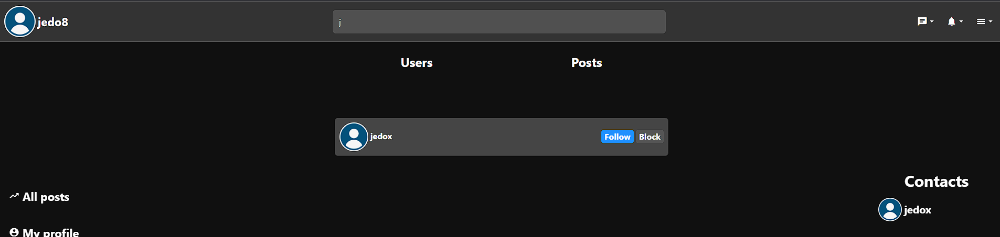

Może wejść na profil danego użytkownika gdzie może wysłać mu wiadomość, zaobserwować go lub zablokować
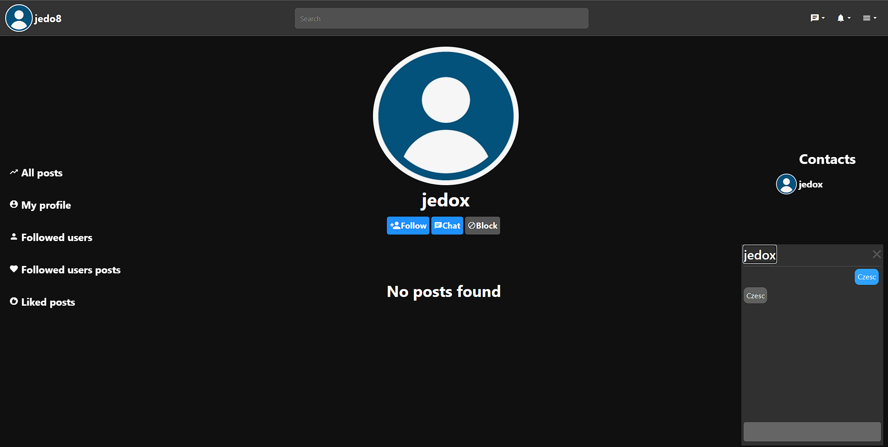

Otrzyma powiadomienie jeśli ktoś polubi/skomentuje jego post/komentarz/odpowiedź
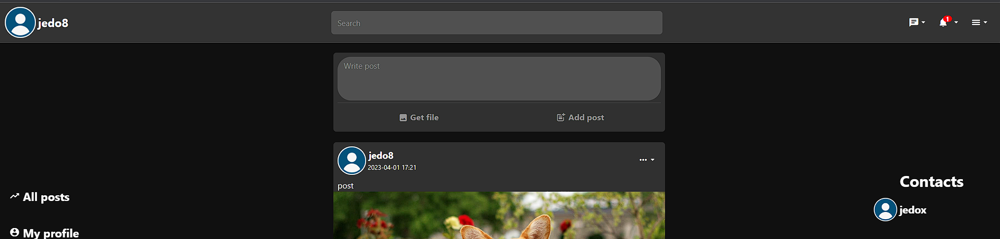

Może wyświetlić listę powiadomień, a po kliknięciu w nie zostanie przeniosiony do posta do którego się ono odnosi
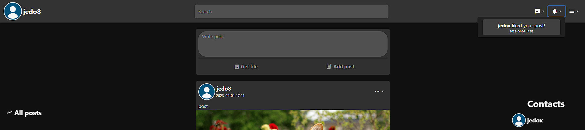

Otrzyma również powiadomienie gdy ktoś do niego napisze
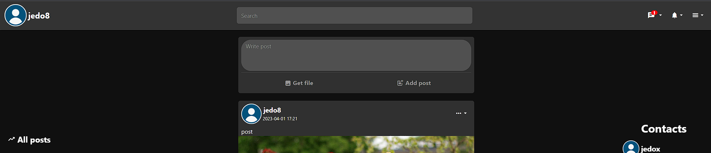

Może wyświetlić listę powiadomień, a po kliknięciu w nie zostanie otwarte okno chatu z użytkownikiem który do niego napisał
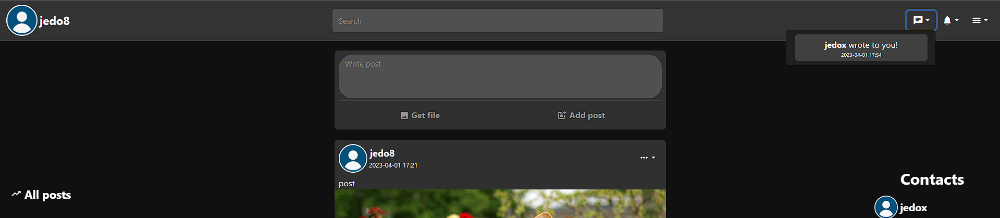

Może wymieniać z nim wiadomości w czasie rzeczywistym
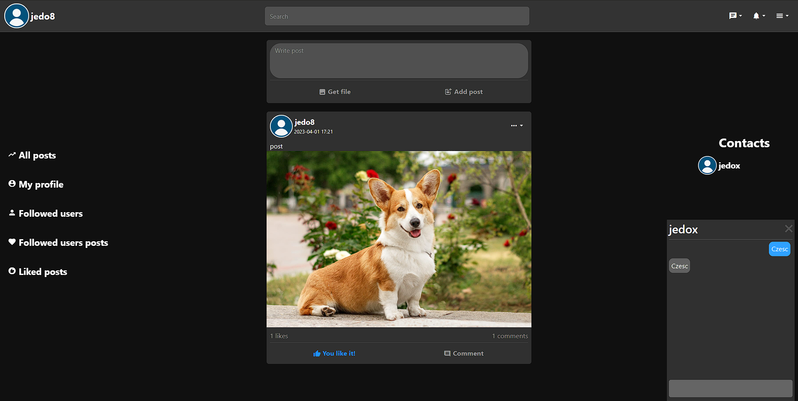

